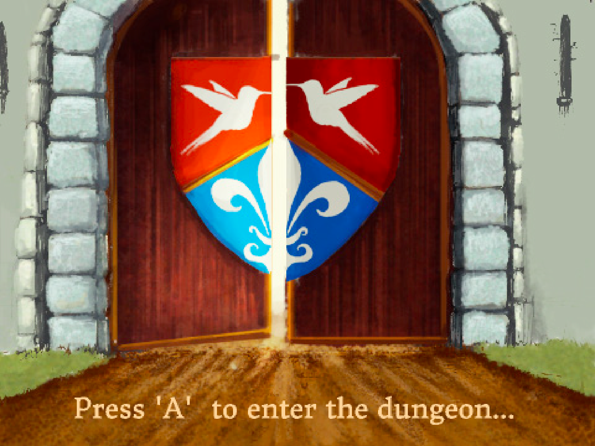
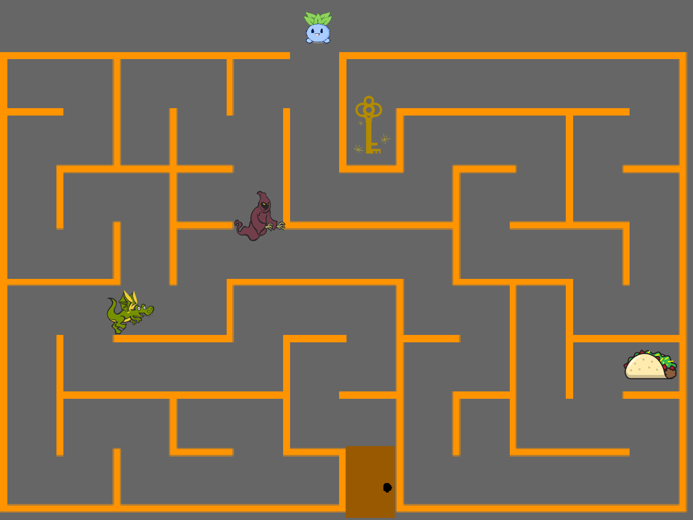
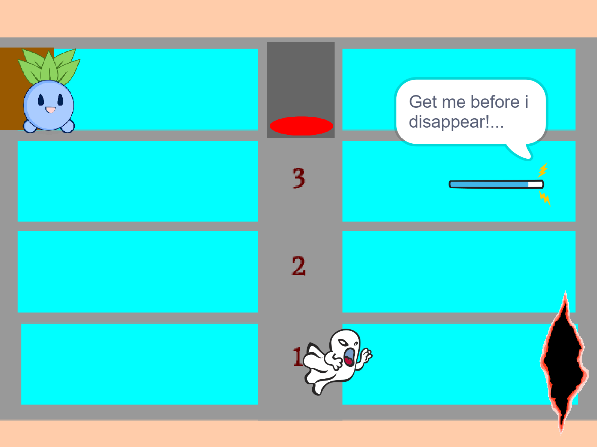
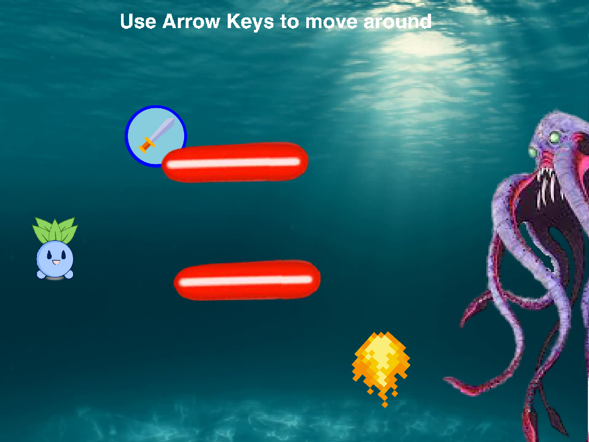

## Dungeon Escape Game

In "Dungeon Escape," players embark on an adventure with the character Oddish (Pokemon) through three challenging levels.

### Level 1: The Maze
Navigate through a treacherous maze to collect a key and a taco, avoiding lightning strikes, a dragon, and a ghoul. With only three lives and 300 seconds, every move counts.

### Level 2: The Elevator
Take on the challenge of a four-level elevator, where a magic wand randomly appears. Dodge a chasing ghost while you use the elevator to retrieve the wand and open the door to the final level.

### Level 3: The Boss Room
Face the fearsome Kraken in an underwater boss battle. With 100 HP, players must dodge lasers and fireballs while waiting for a sword to drop. Collect the sword and press 'F' to strike the Kraken, who has 500 HP. Watch out for health orbs that appear when your HP drops below 50, restoring 20 HP upon collection.

Conquer all three levels and defeat the Kraken to emerge victorious in "Dungeon Escape."
